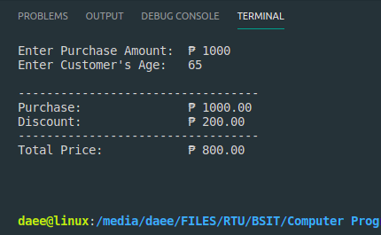
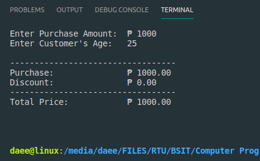
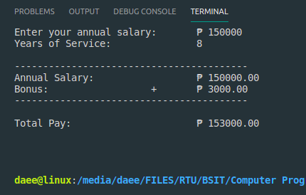
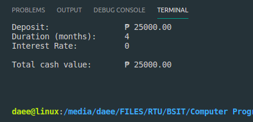
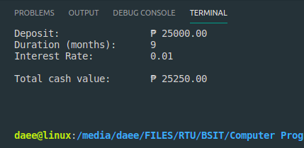
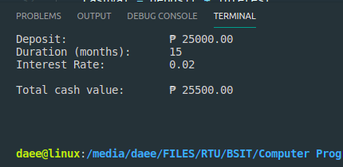
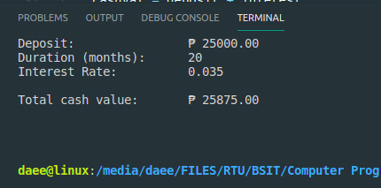

# Lesson 4.3
<br/><br/>

## Requirements :

<br/>

Valid for Linux mint, Debian and other Debian based Linux systems.
<br/><br/>
Confirm your installation by checking for G++ version by the command:
```bash
    g++ --version
```
Install build-essential by the command:
```bash
    sudo apt install build-essential
```

---

Linux terminal:
```bash
    $make discount
    $make bonus
    $make cashv
```
<br/>

---

## **Output :**

<br/>


**Discount Calculator :**


| Age      | Discount    |    Output                                |               
|----------|-------------|------------------------------------------|
| 60+      | 20%         |         |
| below 60 | 0%          |      |


<br/>

**Annual Bonus Calculator :**

| Service        |    Output                                |               
|----------------|------------------------------------------|
| 5+ yrs         |     |
| less than 5yrs |     |


**Total cash value**

| Duration(_months_)|    Output                                    |               
|-------------------|----------------------------------------------|
|       m < 6       |         |
|  6 <= m <= 12     |    |
| 13 <= m <= 18     |   |
| 19 <= m <= 24     |   |


---
<br/><br/>


fuuujin :

[![alt text][1.1]][1]
[![alt text][1.2]][1]
[![alt text][1.3]][1]


[1.1]: ./res/icon/facebook.png
[1.2]: ./res/icon/github.png
[1.3]: ./res/icon/google-plus.png

[1]: https://www.facebook.com/daee1910
[2]: https://github.com/fuuujin
[3]: acebo.dale@gmail.com
